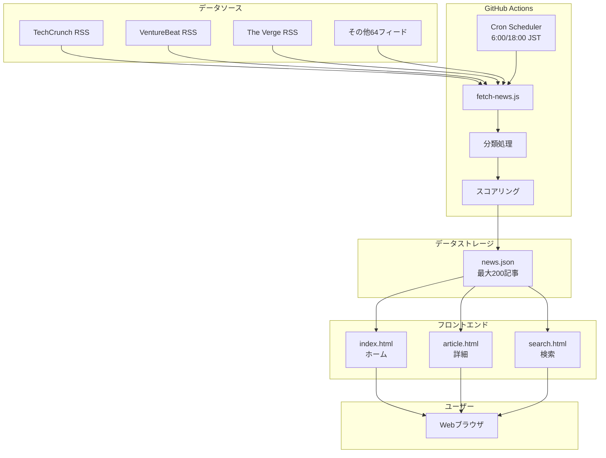
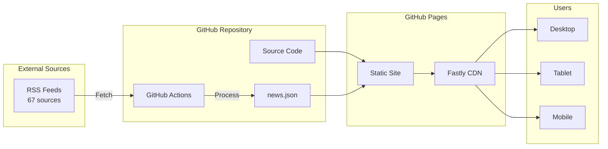

# AI Weekly News - AIニュース自動収集システム

## 目次
1. [プロジェクト概要](#プロジェクト概要)
2. [要件定義書](#要件定義書)
3. [基本設計書](#基本設計書)
4. [詳細設計書](#詳細設計書)
5. [技術スタック](#技術スタック)
6. [システムアーキテクチャ](#システムアーキテクチャ)
7. [インストールと設定](#インストールと設定)
8. [使用方法](#使用方法)
9. [開発ガイド](#開発ガイド)

---

## プロジェクト概要

AI Weekly Newsは、世界中のAI関連ニュースを自動収集し、整理して表示するWebアプリケーションです。67以上のRSSフィードから最新のAIニュースを収集し、カテゴリー別に分類して提供します。

### 主な特徴
- 🤖 **自動ニュース収集**: GitHub Actionsによる1日2回の自動更新
- 📊 **スマートカテゴリー分類**: 50以上のカテゴリーによる詳細な分類
- 🎯 **重要度スコアリング**: 記事の重要度を自動評価
- 📱 **レスポンシブデザイン**: モバイル・タブレット・デスクトップ対応
- 🔍 **高度な検索機能**: カテゴリー別・キーワード検索対応

### デモサイト
https://takum004.github.io/ai-news-weekly/

---

## 要件定義書

### 1. 機能要件

#### 1.1 ニュース収集機能
- **RSS Feed収集**
  - 67のRSSフィードからニュースを自動収集
  - 重複記事の排除
  - 7日以内の記事のみを対象
  - 最大200記事を保持

#### 1.2 記事分類機能
- **カテゴリー分類**
  - 企業別: OpenAI, Google, Anthropic, Microsoft, Meta, xAI, NVIDIA
  - 技術別: 動画生成, 画像生成, 音声生成, 音楽生成, 3Dモデリング
  - 用途別: エージェント, 自動化, コード生成, 翻訳, マルチモーダル
  - 業界別: ヘルスケア, 金融, 教育, 製造業, 農業, エネルギー

#### 1.3 表示機能
- **ホームページ**
  - 3列グリッドレイアウト
  - カテゴリーフィルター
  - 検索機能
  - 重要度バッジ表示

- **記事詳細ページ**
  - 4セクション構成
    1. What's this about? - 概要
    2. Key Points - 重要ポイント
    3. Why it matters - なぜ重要か
    4. What's next - 今後の展望

#### 1.4 検索機能
- **検索ページ**
  - カテゴリー別フィルタリング
  - キーワード検索
  - 検索結果のリアルタイム表示

### 2. 非機能要件

#### 2.1 パフォーマンス
- ページロード時間: 3秒以内
- RSS更新処理: 5分以内
- 静的サイトによる高速配信

#### 2.2 可用性
- GitHub Pages による99.9%以上の稼働率
- CDN による世界中からのアクセス対応

#### 2.3 セキュリティ
- 静的サイトによるセキュアな配信
- APIキーのGitHub Secrets管理

---

## 基本設計書

### 1. システム構成



### 2. データ構造

#### 2.1 記事データモデル

```json
{
  "id": "一意識別子（base64エンコード）",
  "title": "記事タイトル",
  "summary": "記事要約",
  "source": "ニュースソース名",
  "category": "カテゴリー",
  "importance": 0-100,
  "pubDate": "ISO 8601形式",
  "link": "元記事URL"
}
```

#### 2.2 news.jsonファイル構造

```json
{
  "lastUpdated": "最終更新日時",
  "totalArticles": 記事総数,
  "generatedBy": "AI News Aggregator v1.0",
  "sources": ソース数,
  "articles": [記事配列]
}
```

### 3. 画面設計

#### 3.1 ホームページレイアウト

```
┌─────────────────────────────────────┐
│          ヘッダー                    │
├─────────────────────────────────────┤
│          ヒーローセクション           │
├─────────────────────────────────────┤
│       カテゴリータブ                 │
├─────────────────────────────────────┤
│  記事1  │  記事2  │  記事3  │
├─────────┼─────────┼─────────┤
│  記事4  │  記事5  │  記事6  │
├─────────┼─────────┼─────────┤
│  ...    │  ...    │  ...    │
└─────────────────────────────────────┘
```

#### 3.2 記事詳細ページレイアウト

```
┌─────────────────────────────────────┐
│          ヘッダー                    │
├─────────────────────────────────────┤
│    記事タイトル                      │
│    カテゴリー | 日付 | ソース        │
├─────────────────────────────────────┤
│    1. What's this about?            │
│    概要文                           │
├─────────────────────────────────────┤
│    2. Key Points                    │
│    • ポイント1                      │
│    • ポイント2                      │
│    • ポイント3                      │
├─────────────────────────────────────┤
│    3. Why it matters                │
│    • 重要性1                        │
│    • 重要性2                        │
├─────────────────────────────────────┤
│    4. What's next                   │
│    • 今後の展望1                    │
│    • 今後の展望2                    │
└─────────────────────────────────────┘
```

---

## 詳細設計書

### 1. モジュール構成

#### 1.1 フロントエンドモジュール

```
/
├── index.html          # ホームページ
├── article.html        # 記事詳細ページ
├── search.html         # 検索ページ
├── script.js           # メインJavaScript
├── article.js          # 記事詳細用JavaScript
├── style.css           # スタイルシート
└── data/
    └── news.json       # ニュースデータ
```

#### 1.2 バックエンドモジュール

```
scripts/
├── fetch-news.js       # RSS収集・処理
├── create-initial-data.js  # 初期データ生成
└── fetch-tweets.js     # Twitter連携（将来用）
```

### 2. 主要関数仕様

#### 2.1 fetch-news.js

```javascript
// RSS収集関数
async function fetchAllFeeds() {
  const feeds = [...]; // 67フィード
  const allArticles = [];
  
  for (const feedUrl of feeds) {
    try {
      const articles = await fetchFeed(feedUrl);
      allArticles.push(...articles);
    } catch (error) {
      console.error(`Error: ${feedUrl}`, error);
    }
  }
  
  return processArticles(allArticles);
}

// 記事処理関数
function processArticles(articles) {
  return articles
    .filter(isRecent)          // 7日以内
    .map(enrichArticle)        // カテゴリー・スコア追加
    .filter(removeDuplicates)  // 重複削除
    .sort(byImportance)        // 重要度順
    .slice(0, 200);            // 上位200件
}

// カテゴリー分類関数
function categorizeArticle(title, content) {
  const text = `${title} ${content}`.toLowerCase();
  
  // 企業チェック
  if (text.includes('openai') || text.includes('chatgpt')) 
    return 'openai';
  if (text.includes('google') || text.includes('gemini')) 
    return 'google';
  
  // 技術チェック
  if (text.includes('video') && text.includes('generat'))
    return 'video_generation';
    
  // デフォルト
  return 'tech';
}

// 重要度計算関数
function calculateImportance(title, content, date) {
  let score = 50; // 基本スコア
  
  // キーワードによる加点
  const keywords = {
    'breakthrough': 20,
    'launches': 15,
    'announces': 15,
    'major': 10
  };
  
  // 新しさによる加点
  const hoursSincePublish = (Date.now() - date) / 3600000;
  if (hoursSincePublish < 6) score += 20;
  else if (hoursSincePublish < 24) score += 10;
  
  return Math.min(100, score);
}
```

#### 2.2 script.js

```javascript
// ニュース表示関数
function displayNews(articles) {
  const newsGrid = document.getElementById('news-grid');
  
  const html = articles.map(article => `
    <article class="news-card ${article.category}">
      <div class="news-card-header">
        <span class="category-badge">
          ${categoryLabels[article.category]}
        </span>
        ${article.importance >= 90 ? 
          '<span class="importance-badge">🔥 重要</span>' : ''}
      </div>
      <div class="news-card-content">
        <h3>${article.title}</h3>
        <p>${article.summary}</p>
      </div>
      <div class="news-card-footer">
        <a href="article.html?id=${article.id}">詳細を見る</a>
        <a href="${article.link}" target="_blank">元記事</a>
      </div>
    </article>
  `).join('');
  
  newsGrid.innerHTML = html;
}

// フィルタリング関数
function filterNews(category, searchTerm) {
  let filtered = allNews;
  
  if (category !== 'all') {
    filtered = filtered.filter(a => a.category === category);
  }
  
  if (searchTerm) {
    filtered = filtered.filter(a => 
      a.title.toLowerCase().includes(searchTerm) ||
      a.summary.toLowerCase().includes(searchTerm)
    );
  }
  
  return filtered;
}
```

#### 2.3 article.js

```javascript
// 記事詳細生成関数
function generateDetailedReport(article) {
  const sections = [];
  
  // 1. 概要
  sections.push(`
    <h3>1. What's this about?</h3>
    <p>${article.summary}</p>
  `);
  
  // 2. キーポイント
  sections.push(`
    <h3>2. Key Points</h3>
    ${generateKeyPoints(article)}
  `);
  
  // 3. 重要性
  sections.push(`
    <h3>3. Why it matters</h3>
    ${generateWhyItMatters(article)}
  `);
  
  // 4. 今後の展望
  sections.push(`
    <h3>4. What's next</h3>
    ${generateWhatsNext(article)}
  `);
  
  return sections.join('');
}
```

### 3. CSS設計

#### 3.1 グリッドレイアウト

```css
.news-grid {
  display: grid;
  grid-template-columns: repeat(3, 1fr);
  gap: 1.5rem;
}

/* レスポンシブ対応 */
@media (max-width: 1024px) {
  .news-grid {
    grid-template-columns: repeat(2, 1fr);
  }
}

@media (max-width: 480px) {
  .news-grid {
    grid-template-columns: 1fr;
  }
}
```

### 4. GitHub Actions設定

```yaml
name: Update News and Deploy

on:
  schedule:
    - cron: '0 21 * * *'  # JST 6:00
    - cron: '0 3 * * *'   # JST 12:00
  workflow_dispatch:

jobs:
  update-news:
    runs-on: ubuntu-latest
    steps:
      - uses: actions/checkout@v4
      - uses: actions/setup-node@v4
      - run: npm install
      - run: npm run update-news
      - run: |
          git config --local user.email "actions@github.com"
          git config --local user.name "GitHub Actions"
          git add -A
          git commit -m "Update AI news - $(date)"
          git push
```

---

## 技術スタック

### フロントエンド
- **HTML5**: セマンティックマークアップ
- **CSS3**: Grid Layout, Flexbox, CSS Variables
- **JavaScript (ES6+)**: async/await, モジュール
- **レスポンシブデザイン**: Mobile-first approach

### バックエンド
- **Node.js**: RSS収集・処理
- **GitHub Actions**: 自動化
- **GitHub Pages**: ホスティング

### ライブラリ
- **rss-parser**: RSS/Atomフィード解析
- **axios**: HTTP通信
- **cheerio**: HTML解析

---

## システムアーキテクチャ

### データフロー

```
1. RSS収集 (6:00/18:00 JST)
   ↓
2. 記事解析・分類
   ↓
3. 重要度スコアリング
   ↓
4. JSON生成・保存
   ↓
5. GitHub Pages自動デプロイ
   ↓
6. CDN配信
   ↓
7. ユーザーアクセス
```

### システム構成図



### セキュリティ設計
- 静的サイトによるセキュアな配信
- APIキーのGitHub Secrets管理
- HTTPS強制
- XSS対策（HTMLエスケープ）

---

## インストールと設定

### 1. リポジトリのクローン
```bash
git clone https://github.com/takum004/ai-news-weekly.git
cd ai-news-weekly
```

### 2. 依存関係のインストール
```bash
npm install
```

### 3. ローカル開発
```bash
# ニュース更新
npm run update-news

# ローカルサーバー起動
python -m http.server 8000
```

### 4. GitHub Actionsの設定
リポジトリのSettings > Secrets and variablesで以下を設定:
- `OPENAI_API_KEY` (オプション)
- `DEEPL_API_KEY` (オプション)

---

## 使用方法

### ユーザー向け
1. https://takum004.github.io/ai-news-weekly/ にアクセス
2. カテゴリータブで興味のある分野を選択
3. 記事をクリックして詳細を表示
4. 検索機能で特定のトピックを検索

### 開発者向け
1. 新しいRSSフィードの追加: `scripts/fetch-news.js`の`RSS_FEEDS`配列に追加
2. カテゴリーの追加: `categorizeArticle`関数を更新
3. スタイルの変更: `style.css`を編集

---

## 開発ガイド

### コーディング規約
- ES6+の機能を使用
- async/awaitによる非同期処理
- エラーハンドリングの徹底
- コメントは日本語OK

### ブランチ戦略
```
main (本番環境)
├── develop (開発環境)
│   ├── feature/xxx (新機能)
│   ├── fix/xxx (バグ修正)
│   └── refactor/xxx (リファクタリング)
```

### テスト
```bash
# ローカルでニュース更新テスト
npm run update-news

# ビルドチェック
npm run build
```

### デプロイ
mainブランチへのプッシュで自動デプロイ

---

## トラブルシューティング

### よくある問題

#### Q: ニュースが表示されない
A: ブラウザのキャッシュをクリア（Ctrl+Shift+R）してください

#### Q: GitHub Actionsが失敗する
A: Actions権限とSecrets設定を確認してください

#### Q: 記事詳細ページでエラーが発生する
A: URLパラメータが正しいか確認してください

---

## 今後の拡張予定

- [ ] 多言語対応（英語以外）
- [ ] ユーザー認証とお気に入り機能
- [ ] コメント機能
- [ ] RSS以外のデータソース対応
- [ ] AIによる記事要約の高度化

---

## ライセンス
MIT License

## 貢献
プルリクエスト歓迎です！

## 連絡先
Issues: https://github.com/takum004/ai-news-weekly/issues

---

**作成日**: 2025-06-21  
**最終更新**: 2025-06-28  
**バージョン**: 3.0.0  
**ステータス**: ✅ 本番稼働中